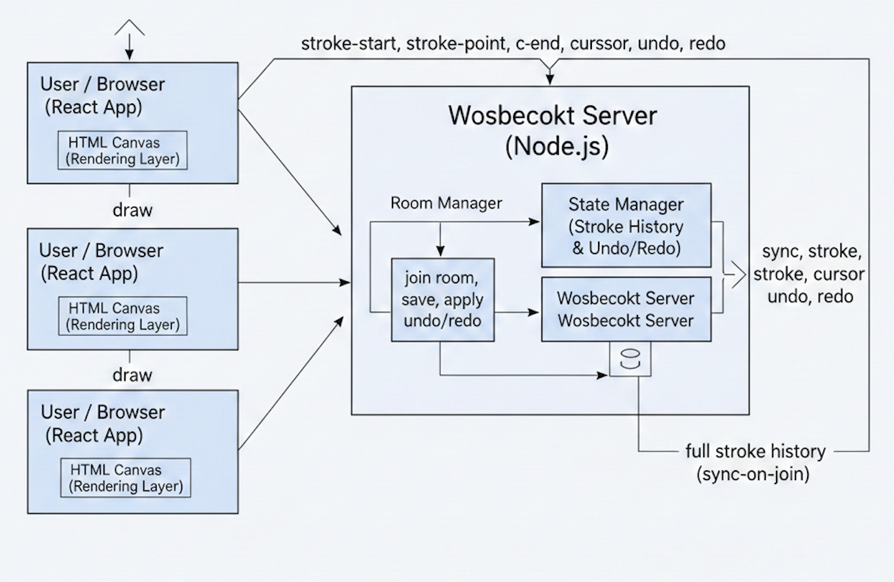

# 🧠 Architecture – Real-Time Collaborative Drawing Canvas

This document describes the system architecture, real-time data flow, WebSocket protocol, and design decisions for the **Real-Time Collaborative Drawing Canvas**.

The application is designed to support **multiple users drawing simultaneously** on a shared canvas with **global undo/redo**, **real-time synchronization**, and **room isolation**.

---

## 1️⃣ High-Level Architecture

The system follows a **client–server architecture**.

### Client (Browser / React)
- Captures pointer input (mouse, pen, touch)
- Renders drawings using the raw HTML Canvas API
- Displays:
  - Real-time drawings
  - Ghost cursors
  - Online users
  - Active drawers
- Sends drawing events to the server via WebSockets

### Server (Node.js + WebSockets)
- Acts as the **single source of truth**
- Maintains global stroke history per room
- Handles undo/redo operations
- Broadcasts real-time updates to all users in a room
- Manages rooms and connected users

> The canvas itself is not the state.  
> The **stroke history stored on the server** represents the authoritative state.

---

## 2️⃣ Data Flow Diagram

The following diagram illustrates how drawing data flows between multiple users and the WebSocket server.  
The server acts as the **single source of truth**, managing stroke history, undo/redo, and room isolation.



### Explanation

- Users draw on the HTML Canvas in their browser (React app)
- Drawing actions are converted into events (`stroke-start`, `stroke-point`, `stroke-end`)
- Events are sent to the WebSocket server
- The server:
  - Manages rooms
  - Stores stroke history
  - Applies undo/redo
- The server broadcasts updates to all users in the same room
- New users receive the **full stroke history** on join (sync-on-join)


This ensures:
- Late joiners see the complete canvas
- Refreshing a page restores drawings
- All clients remain consistent

---

## 3️⃣ WebSocket Protocol

All communication between client and server uses **JSON messages over WebSockets**.

### Client → Server Messages

#### `stroke-start`
Sent when a user begins drawing.
```json
{
  "type": "stroke-start",
  "x": 120,
  "y": 300,
  "tool": "brush",
  "color": "#2ed573",
  "width": 5
}
````

#### `stroke-point`

Sent while the user is drawing.

```json
{
  "type": "stroke-point",
  "x": 125,
  "y": 305
}
```

#### `stroke-end`

Sent when the user finishes a stroke.

```json
{
  "type": "stroke-end"
}
```

#### `cursor`

Sent to update cursor position.

```json
{
  "type": "cursor",
  "x": 400,
  "y": 220
}
```

#### `undo`

```json
{
  "type": "undo"
}
```

#### `redo`

```json
{
  "type": "redo"
}
```

#### `shape` (Rectangle tool)

```json
{
  "type": "shape",
  "shape": "rect",
  "start": { "x": 100, "y": 100 },
  "end": { "x": 200, "y": 200 },
  "color": "#ff4757",
  "width": 4
}
```

---

### Server → Client Messages

#### `welcome` (Sync-on-Join)

```json
{
  "type": "welcome",
  "id": "user-id",
  "color": "#1e90ff",
  "users": [{ "id": "...", "color": "..." }],
  "strokes": [ ... ]
}
```

#### `user-joined`

```json
{
  "type": "user-joined",
  "id": "user-id",
  "color": "#ffa502"
}
```

#### `user-left`

```json
{
  "type": "user-left",
  "id": "user-id"
}
```

#### `sync` (Undo / Redo result)

```json
{
  "type": "sync",
  "strokes": [ ... ]
}
```

All real-time drawing messages include:

```json
"from": "user-id"
```

---

## 4️⃣ Undo / Redo Strategy (Global)

Undo and redo are implemented **globally** and handled **server-side**.

### Server State Model

* `strokes[]` – committed drawing operations
* `redoStack[]` – undone strokes

### Undo Flow

1. Any user sends `{ "type": "undo" }`
2. Server:

   * Removes the last stroke from `strokes`
   * Pushes it into `redoStack`
3. Server broadcasts:

   ```json
   { "type": "sync", "strokes": [...] }
   ```
4. Clients:

   * Clear canvas
   * Replay all strokes

### Redo Flow

1. User sends `{ "type": "redo" }`
2. Server:

   * Pops a stroke from `redoStack`
   * Adds it back to `strokes`
3. Server broadcasts updated state
4. Clients redraw canvas

### Key Properties

* Any user can undo another user’s drawing
* Canvas state remains deterministic
* All clients stay synchronized

---

## 5️⃣ Performance Decisions

### Raw Canvas API

* No external drawing libraries
* Full control over rendering pipeline
* Minimal overhead

### Client-Side Prediction

* Users draw immediately on their local canvas
* Network latency does not affect drawing smoothness

### Incremental Stroke Streaming

* Only stroke points are sent (not images)
* Reduces bandwidth usage
* Scales well with multiple users

### React Refs for Real-Time Data

* Cursor positions and drawing configuration stored in refs
* Prevents unnecessary re-renders
* Avoids stale state in pointer event handlers

### Canvas Layering

* Main canvas: persistent drawings
* Overlay canvas: cursors and user indicators
* Prevents transient UI from affecting drawing state

---

## 6️⃣ Conflict Handling

The system allows **simultaneous drawing without locking**.

### Strategy: Operation-Based Concurrency

* Each stroke is an independent operation
* Server determines the final ordering of strokes
* Overlapping drawings are allowed
* Final canvas state is the replay of ordered stroke history

### Why No Locking?

* Locking reduces collaboration
* Modern collaborative tools allow overlapping edits
* Responsiveness is prioritized over exclusivity

---

## 7️⃣ Room Architecture

The application supports **multiple isolated rooms**.

Each room maintains:

* Its own connected users
* Independent stroke history
* Separate undo/redo stacks

Rooms are identified using URL parameters:

```
/?room=alpha
/?room=beta
```

Users in different rooms do not see each other’s drawings.

---

## 8️⃣ Summary

This architecture ensures:

* Real-time multi-user collaboration
* Strong canvas performance
* Deterministic global state
* Robust undo/redo
* Clean separation of concerns
* Easy extensibility